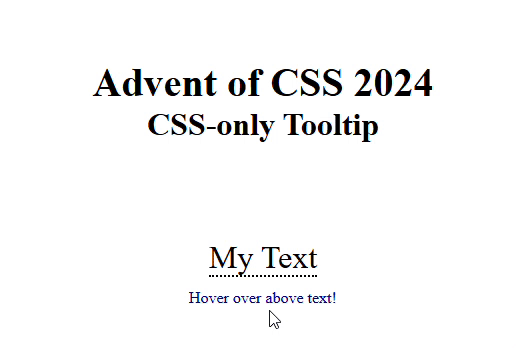

# Advent of CSS 2024

## Challenge 3 - Tooltip

Today's challenge is a CSS-only tooltip upon hover. 

Original challenge site from Amy Dutton [here](https://www.adventofcss.com/).

## Approach/Demo

Vanilla HTML/CSS was used for this challenge.

A final webpage showing the tooltip is shown [here](https://myrojoylee.github.io/aoc-2024-challenge-3/).

Demo below showing tooltip upon hover:

## Notes/Improvements

Accessibility wasn't the focus so that could definitely have been improved.

## Credits

CSS Triangle adapted from [here](https://css-tricks.com/snippets/css/css-triangle/).

## License

Refer to the the license in the repository.